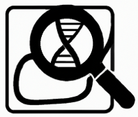

# PubMatcher

**PubMatcher** is an automated genomic research tool that integrates biological databases and APIs to facilitate genetic interpretation. It allows users to search publications, extract protein function information, check mouse phenotypes, and access PanelApp data. Results are presented in a user-friendly manner, with an option to export reports as PDF.

Pensé et developpé par Victor Marin , Victor Dumont , Hugo Lannes et Louis Lebreton
