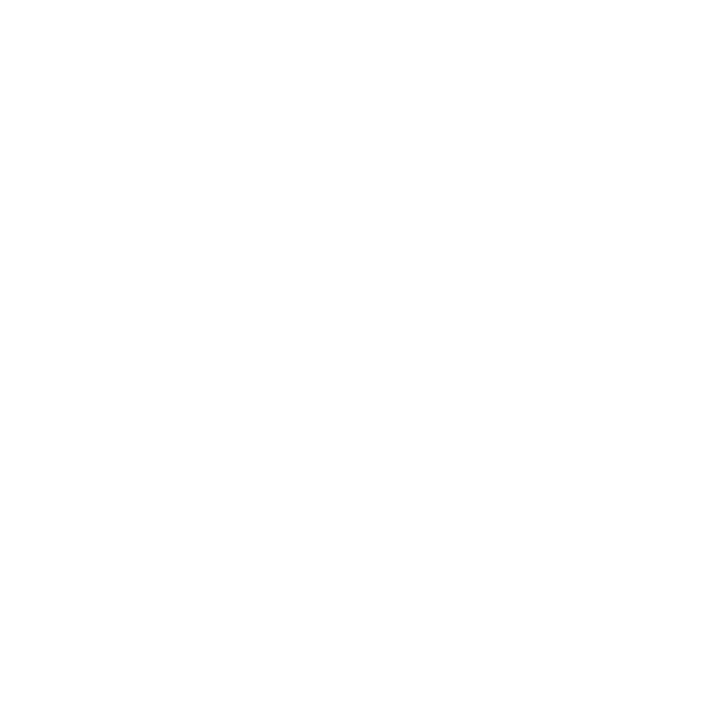

<div align="center">

# PubMatcher



**A web application to support genomic data interpretation through simplified bibliographic research**

[](https://nodejs.org/)
[](https://vuejs.org/)
[](https://www.postgresql.org/)
[](LICENSE)

[Live Demo](https://pubmatcher.fr) · [Request Feature](https://github.com/victormar1/PubMatcher/issues)

</div>

---

## 📖 About

PubMatcher is an automated genomic research tool that integrates biological databases and APIs to facilitate genetic interpretation. It enables batch analysis of gene lists, combining automated PubMed searches with curated databases to help geneticists identify relevant disease genes, especially those not yet fully documented in OMIM.

### Key Features

- 🔬 **Batch Gene Analysis** - Analyze multiple genes simultaneously
- 📚 **Automated PubMed Search** - Real-time literature queries with phenotype matching
- 🗃️ **Multi-Database Aggregation** - ClinVar, gnomAD, PanelApp, IMPC, UniProt in one view
- 📊 **Constraint Metrics** - gnomAD v2.1 and v4 with automatic comparison
- 🐭 **Mouse Phenotypes** - IMPC knockout data visualization
- 📄 **PDF Export** - Generate comprehensive reports
- 👤 **User Accounts** - Save search history

---

## 🛠️ Technical Stack

| Component | Technology |
|-----------|------------|
| **Backend** | Node.js 18.x, Express.js 4.17 |
| **Frontend** | Vue.js 3.5, Tailwind CSS |
| **Database** | PostgreSQL 14+ |
| **Containerization** | Docker, Docker Compose |

---

## 📦 Installation

### Prerequisites

- [Node.js](https://nodejs.org/) 18.x or higher
- [PostgreSQL](https://www.postgresql.org/) 14 or higher
- [npm](https://www.npmjs.com/) 9.x or higher

### Option 1: Local Development

```bash
# 1. Clone the repository
git clone https://github.com/victormar1/PubMatcher.git
cd pubmatcher

# 2. Install dependencies
npm install

# 3. Configure environment
cp .env.example .env
# Edit .env with your configuration

# 4. Initialize database
psql -U postgres -f database/schema.sql

# 5. Build frontend
npm run build

# 6. Start the server
node app.js
```

The application will be available at `http://localhost:3000`

### Option 2: Docker Deployment (Recommended)

```bash
# 1. Clone the repository
git clone https://github.com/victormar1/PubMatcher.git
cd pubmatcher

# 2. Configure environment
cp .env.example .env
# Edit .env with your configuration (at minimum, change DB_PASSWORD and SECRET_KEY)

# 3. Start with Docker Compose (includes PostgreSQL)
docker-compose -f docker/docker-compose.yml up -d

# 4. Check logs
docker-compose -f docker/docker-compose.yml logs -f app
```

The application will be available at `http://localhost:3000`

---

## ⚙️ Configuration

Copy `.env.example` to `.env` and configure the following variables:

| Variable | Description | Default |
|----------|-------------|---------|
| `PORT` | Server port | `3000` |
| `NODE_ENV` | Environment (development/production) | `development` |
| `DB_HOST` | PostgreSQL host | `localhost` |
| `DB_PORT` | PostgreSQL port | `5432` |
| `DB_NAME` | Database name | `pubmatcher` |
| `DB_USER` | Database user | `pubmatcher` |
| `DB_PASSWORD` | Database password | - |
| `SECRET_KEY` | Secret for JWT tokens | - |
| `SMTP_*` | Email configuration for password reset | - |

---

## 🗄️ Data Sources

PubMatcher integrates data from multiple sources:

| Source | Access Method | Update | Description |
|--------|---------------|--------|-------------|
| **PubMed** | Web scraping | Real-time | Scientific literature |
| **HGNC** | REST API (XML) | Real-time | Gene nomenclature validation |
| **IMPC** | SOLR API | Real-time | Mouse knockout phenotypes |
| **PanelApp UK** | REST API (JSON) | Real-time | Clinical panels (Genomics England) |
| **PanelApp AUS** | REST API (JSON) | Real-time | Clinical panels (Australian Genomics) |
| **UniProt** | REST API | Real-time | Protein function |
| **OMIM** | Via Ensembl API | Real-time | Disease associations |
| **ClinVar** | Local JSON | Periodic | Variant counts per gene |
| **gnomAD v2.1** | Local CSV | Static | Constraint metrics |
| **gnomAD v4** | Local CSV | Static | Constraint metrics |
| **ClinGen** | Local CSV | Periodic | Gene validity classifications |

---

## 🔌 API

PubMatcher provides a REST API for programmatic access:

### Search Genes

```bash
POST /api/search
Content-Type: application/json

{
  "genes": ["BRCA1", "TP53", "EGFR"],
  "phenotypes": ["cancer", "tumor"]
}
```

### Response

```json
{
  "cached": false,
  "results": [
    {
      "gene": "BRCA1",
      "url": "https://pubmed.ncbi.nlm.nih.gov/?term=...",
      "count": 12345,
      "firstArticleTitle": "...",
      "constraints_v2": { "pLI": 0.99, ... },
      "constraints_v4": { "pLI": 0.98, ... },
      "panelAppEnglandCount": 42,
      "mousePhenotypes": { ... }
    }
  ]
}
```

---

## 📁 Project Structure

```
pubmatcher/
├── app.js                      # Main application entry point
├── config/                     # Server configuration
├── controllers/                # Route controllers
├── database/                   # Database schema
├── docker/                     # Docker configuration
│   ├── Dockerfile              # Image build instructions
│   ├── docker-compose.yml      # Standalone deployment
│   └── docker-compose.production.yml  # Production (Traefik)
├── models/                     # Data models
├── routes/                     # API routes
├── services/                   # Business logic
├── utils/                      # Utility functions (data fetchers)
├── src/                        # Vue.js frontend source
│   ├── components/             # Vue components
│   ├── stores/                 # Pinia stores
│   └── router.js               # Frontend routing
├── public/                     # Static files
└── BDD/                        # Local data files (CSV, JSON)
```

---

## 🧪 Development

```bash
# Start development server with hot reload
npm run dev

# Build for production
npm run build

# Format code
npx prettier --write .
```

---

## 🚀 Deployment

### Quick Start (Standalone with PostgreSQL)

This is the easiest way to deploy PubMatcher. It includes everything needed.

```bash
# Configure environment
cp .env.example .env
nano .env  # Edit with your settings

# Start the application
docker-compose -f docker/docker-compose.yml up -d

# View logs
docker-compose -f docker/docker-compose.yml logs -f

# Stop the application
docker-compose -f docker/docker-compose.yml down
```

### Production Deployment (with Traefik)

For production with an existing Traefik reverse proxy:

```bash
# Use the production config
docker-compose -f docker/docker-compose.production.yml up -d
```

> **Note:** `docker-compose.production.yml` assumes you have:
> - An external Docker network named `main_network`
> - Traefik configured with `websecure` entrypoint
> - External PostgreSQL database
> 
> Modify this file to match your infrastructure.

---

## 📄 License

This project is licensed under the MIT License - see the [LICENSE](LICENSE) file for details.

---

## 📚 Citation

If you use PubMatcher in your research, please cite:

> Marin V, et al. (2025). PubMatcher: a web app to support genomic data interpretation through simplified bibliographic research. *European Journal of Human Genetics*. [DOI pending]

---

## 👥 Authors

- **Victor Marin** - *Geneticist, Project Lead*
- **Hugo Lannes** - *Developer*
- **Victor Dumont** - *Developer*
- **Louis Lebreton** - *Contributor*

---

## 🙏 Acknowledgments

- HGNC for gene nomenclature data
- IMPC for mouse phenotype data
- Genomics England and Australian Genomics for PanelApp data
- gnomAD team for constraint metrics
- ClinVar and ClinGen for variant and gene validity data

---

<div align="center">

**[⬆ Back to top](#pubmatcher)**

</div>
